# Agentic AI System Design Patterns

> Google Cloud 제공 에이전트 AI 시스템 설계 패턴 정리 (Last reviewed: 2025-10-08)

---

## 1. 개요

에이전트 설계 패턴은 AI 에이전트 애플리케이션을 구축하기 위한 아키텍처 접근 방식이다.
시스템 구성요소 구성, 모델 통합, 단일/다중 에이전트 조정 방식에 대한 프레임워크를 제공한다.

### AI 에이전트가 적합한 경우

- 자율적 의사 결정이 필요한 개방형 문제
- 복잡한 다단계 워크플로 관리
- 외부 데이터를 활용한 실시간 문제 해결
- 지식 집약적 태스크 자동화

### 에이전트가 불필요한 경우

예측 가능하고 구조화된 단일 호출 작업은 에이전트 없이도 충분하다:
- 문서 요약, 텍스트 번역, 피드백 분류 등

---

## 2. 설계 프로세스

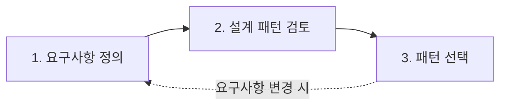

### 요구사항 평가 체크리스트

| 항목 | 질문 |
|------|------|
| **작업 특성** | 사전 정의된 워크플로로 완료 가능한가? 개방형인가? |
| **지연 시간** | 빠른 응답 우선인가? 정확도를 위해 지연 허용 가능한가? |
| **비용** | 단일 요청에 모델 다중 호출을 지원할 수 있는가? |
| **인간 개입** | 중요 결정, 안전, 주관적 승인이 필요한가? |

---

## 3. 단일 에이전트 시스템 (Single Agent)

AI 모델 + 도구 집합 + 시스템 프롬프트로 사용자 요청을 자율 처리하는 기본 패턴.

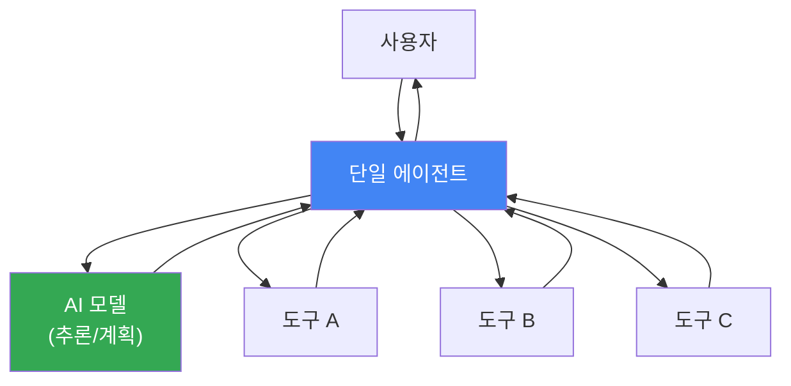

### 적합한 경우

- 여러 단계와 외부 데이터 액세스가 필요한 작업
- 에이전트 개발 초기 단계 (프로토타이핑)
- 예: 고객 지원 상담, 연구 보조

### 한계

- 도구 수 증가 → 성능 저하 (잘못된 도구 선택, 지연 시간 증가)
- ReAct 패턴으로 추론 개선 가능하나, 책임이 너무 많아지면 멀티 에이전트 고려

---

## 4. 멀티 에이전트 시스템

여러 전문 에이전트를 오케스트레이션하여 복잡한 문제를 해결한다.
모듈식 설계로 확장성, 안정성, 유지보수성을 개선한다.

### 핵심 개념: 컨텍스트 엔지니어링

멀티 에이전트 시스템에서 각 에이전트에게 적절한 정보를 전달하는 프로세스:
- 에이전트별 컨텍스트 격리
- 단계 간 정보 유지
- 대량 데이터 압축

---

### 4.1 순차 패턴 (Sequential)

에이전트가 사전 정의된 선형 순서로 실행되며, 이전 에이전트의 출력이 다음의 입력이 된다.
AI 모델 오케스트레이션 없이 사전 정의된 로직으로 작동한다.

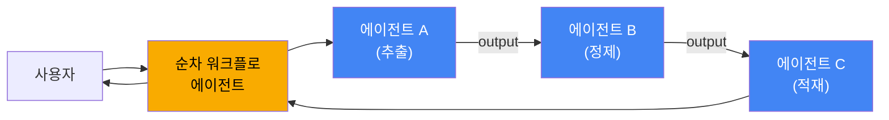

| 장점 | 단점 |
|------|------|
| 낮은 지연 시간/비용 (모델 오케스트레이션 불필요) | 유연성 부족 (동적 조건 적응 어려움) |
| 예측 가능한 실행 흐름 | 불필요한 단계 건너뛰기 불가 |
| | 느린 단계의 누적 지연 |

**적합:** 데이터 처리 파이프라인 (ETL), 고정 순서 프로세스

---

### 4.2 병렬 패턴 (Parallel)

여러 하위 에이전트가 동시에 독립적으로 작업을 실행하고, 결과를 종합한다.
AI 모델 오케스트레이션 없이 작동한다.

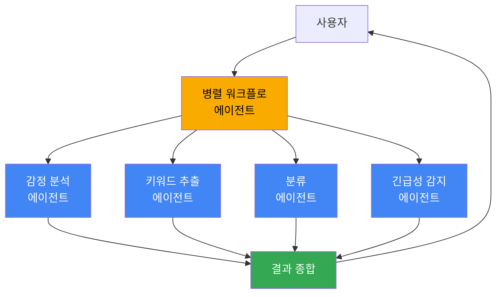

| 장점 | 단점 |
|------|------|
| 전체 지연 시간 단축 | 리소스/토큰 소비 증가 → 운영 비용 증가 |
| 다양한 관점 동시 수집 | 충돌 결과 합성 로직 복잡 |

**적합:** 고객 리뷰 분석, 다중 소스 데이터 수집

---

### 4.3 루프 패턴 (Loop)

종료 조건이 충족될 때까지 하위 에이전트 시퀀스를 반복 실행한다.
AI 모델 오케스트레이션 없이 사전 정의된 로직으로 작동한다.

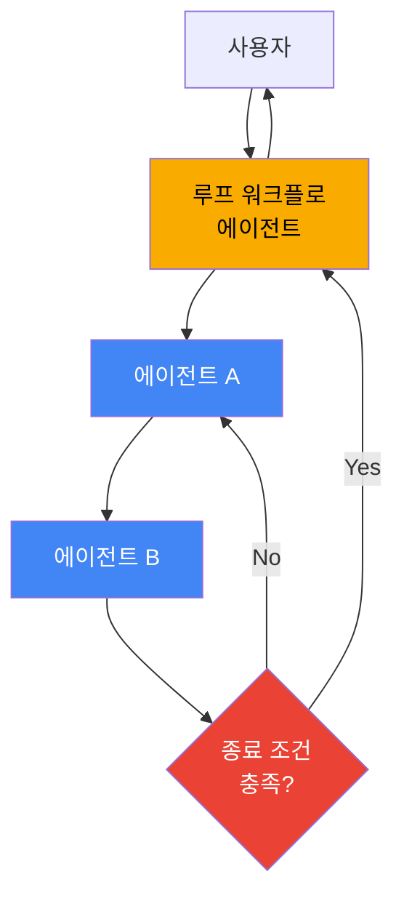

| 종료 조건 예시 |
|---------------|
| 최대 반복 횟수 도달 |
| 품질 기준 충족 (커스텀 상태) |
| 시간 제한 초과 |

| 장점 | 단점 |
|------|------|
| 반복적 개선/자체 수정 가능 | **무한 루프 위험** |
| 품질 달성까지 자동 반복 | 과도한 비용/리소스 소비 가능 |

---

### 4.4 리뷰 및 비판 패턴 (Review & Critique)

생성기 에이전트가 출력을 생성하고, 비평가 에이전트가 검증하는 패턴.
루프 패턴의 구현체이다.

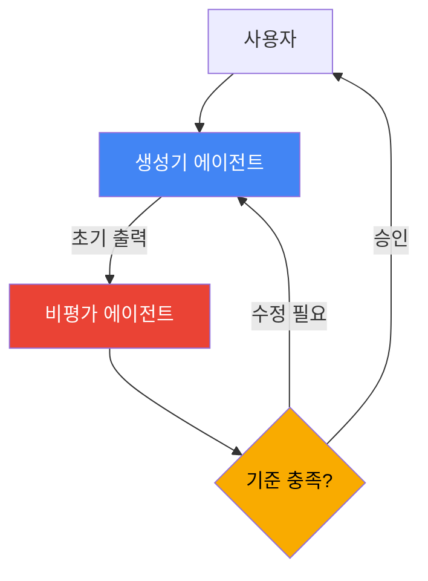

### 검증 기준 예시

- 사실 정확성
- 형식 규칙 준수
- 안전 가이드라인
- 보안 취약점 스캔
- 단위 테스트 통과

**적합:** 코드 생성 + 보안 감사, 콘텐츠 생성 + 팩트 체크

| 장점 | 단점 |
|------|------|
| 출력 품질/정확성/신뢰성 향상 | 추가 모델 호출로 지연 시간/비용 증가 |
| 전용 검증 단계 | 수정 루프 시 누적 비용 |

---

### 4.5 반복적 개선 패턴 (Iterative Refinement)

루핑 메커니즘으로 여러 사이클에 걸쳐 출력을 점진적으로 개선한다.
루프 패턴의 구현체이다.

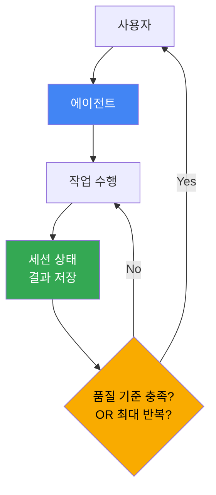

**적합:** 코드 작성 및 디버깅, 다중 파트 계획 수립, 장문 문서 초안 및 수정

| 장점 | 단점 |
|------|------|
| 단일 단계에서 불가능한 고품질 출력 | 사이클마다 지연 시간/비용 증가 |
| 점진적 개선 | 종료 조건 설계 복잡 |

---

### 4.6 코디네이터 패턴 (Coordinator)

**AI 모델을 사용하여** 작업을 동적으로 라우팅하는 중앙 에이전트가 워크플로를 안내한다.
병렬 패턴과 달리 하드코딩된 워크플로가 아닌 모델 기반 동적 오케스트레이션을 수행한다.

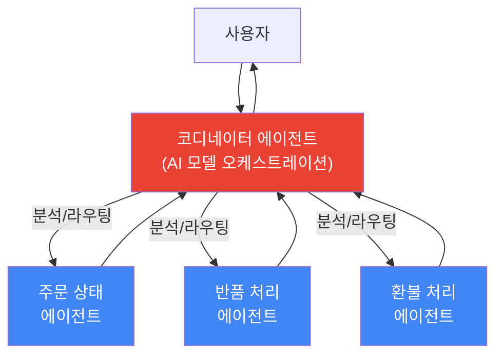

**적합:** 적응형 라우팅이 필요한 비즈니스 프로세스 (고객 서비스, 요청 분류 등)

| 장점 | 단점 |
|------|------|
| 다양한 입력 처리, 런타임 워크플로 조정 | 모델 다중 호출 → 비용/지연 시간 증가 |
| 사전 정의 워크플로 대비 높은 유연성 | 단일 에이전트 대비 복잡한 인프라 |

---

### 4.7 계층적 작업 분해 패턴 (Hierarchical Task Decomposition)

에이전트를 다단계 계층 구조로 구성하여 복잡한 문제를 분해한다.
코디네이터 패턴의 구현체이다.

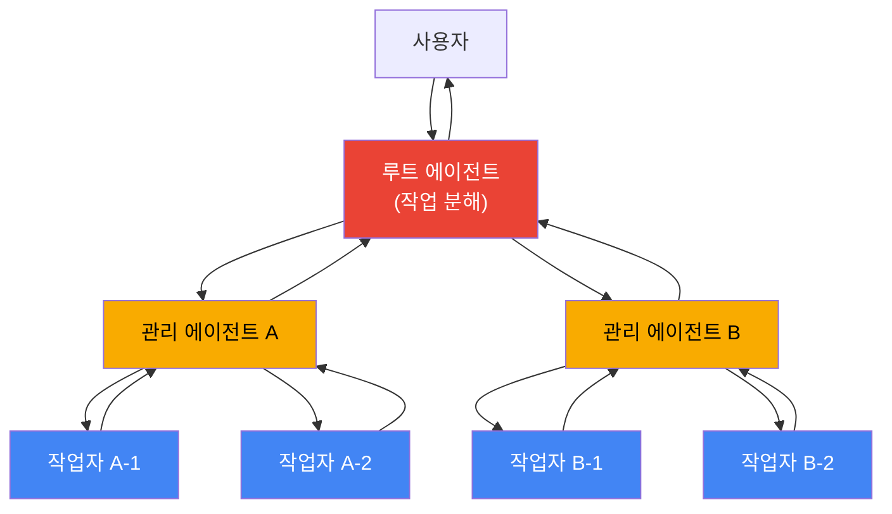

**적합:** 연구, 계획, 종합 등 다단계 추론이 필요한 모호하고 개방적인 문제

| 장점 | 단점 |
|------|------|
| 매우 복잡한 문제의 체계적 분해 | 아키텍처 복잡성 높음 |
| 포괄적이고 고품질의 결과 | 다단계 위임/추론 → 높은 지연 시간/비용 |
| | 디버그/유지보수 어려움 |

---

### 4.8 스웜 패턴 (Swarm)

여러 전문 에이전트가 **all-to-all 통신** 방식으로 협업하여 솔루션을 반복 개선한다.
중앙 감독자/코디네이터 없이 에이전트 간 직접 통신한다.

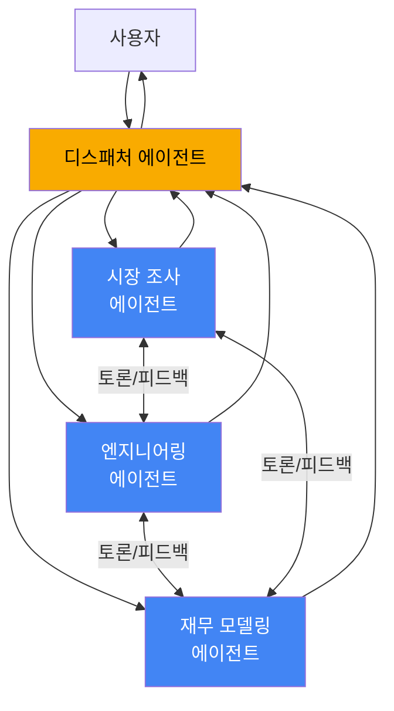

### 종료 조건

- 최대 반복 횟수
- 시간 제한
- 합의 도달 (특정 목표 달성)

**적합:** 신제품 설계, 전략 수립 등 토론과 반복 개선이 필요한 매우 복잡한 문제

| 장점 | 단점 |
|------|------|
| 전문가 협업 시뮬레이션 → 높은 품질 | **가장 복잡하고 비용이 높은 패턴** |
| 창의적 솔루션 생성 | 비생산적 루프/수렴 실패 위험 |
| | 정교한 통신 로직 필요 |

---

## 5. ReAct 패턴 (Reasoning and Acting)

AI 모델이 **사고(Thought) → 행동(Action) → 관찰(Observation)** 루프를 반복하는 패턴.
단일/멀티 에이전트 모두에 적용 가능하다.

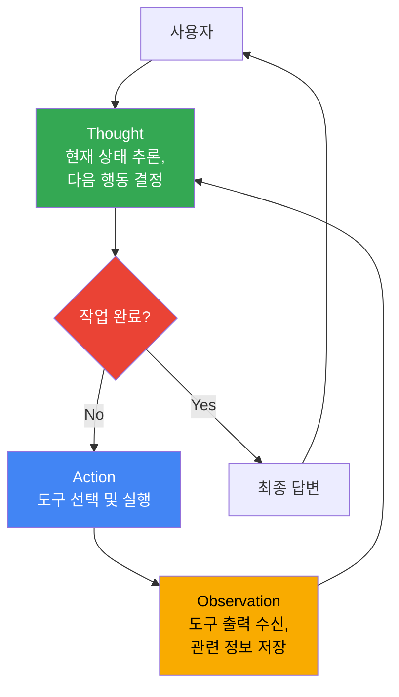

### 종료 조건

- 결정적 답변 도출
- 최대 반복 횟수 도달
- 진행 불가능한 오류 발생

**적합:** 지속적 계획과 적응이 필요한 복잡하고 동적인 작업 (로봇 경로 계획, 복합 질의응답 등)

| 장점 | 단점 |
|------|------|
| 멀티 에이전트보다 구현/유지 간단 | 반복적 다단계 → 지연 시간 증가 |
| Thought 로그로 디버깅 용이 | 모델 추론 품질에 크게 의존 |
| 동적 계획 수립/조정 가능 | 도구 오류가 최종 답변에 전파 가능 |

---

## 6. 인간 참여형 패턴 (Human-In-The-Loop)

사전 정의된 체크포인트에서 에이전트가 실행을 일시중지하고, 인간의 검토/승인을 기다린다.

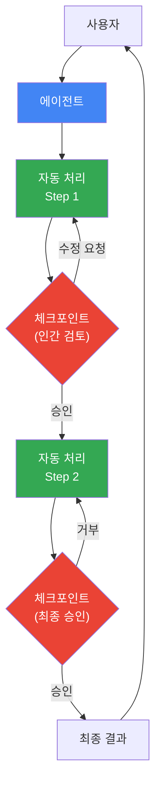

**적합:** 인간 감독, 주관적 판단, 최종 승인이 필요한 작업

- 대규모 금융 거래 승인
- 민감 문서 요약 검증
- 환자 데이터 익명화 검증
- 규정 준수 검증

| 장점 | 단점 |
|------|------|
| 안전성/신뢰성 향상 | 아키텍처 복잡 (외부 시스템 필요) |
| 중요 결정에 인간 판단 삽입 | 인간 응답 대기 → 지연 시간 |

---

## 7. 맞춤 로직 패턴 (Custom Logic)

조건문 등 코드 기반으로 복잡한 분기 워크플로를 구현하는 최대 유연성 패턴.
여러 패턴을 혼합하여 고유한 비즈니스 로직을 구현한다.

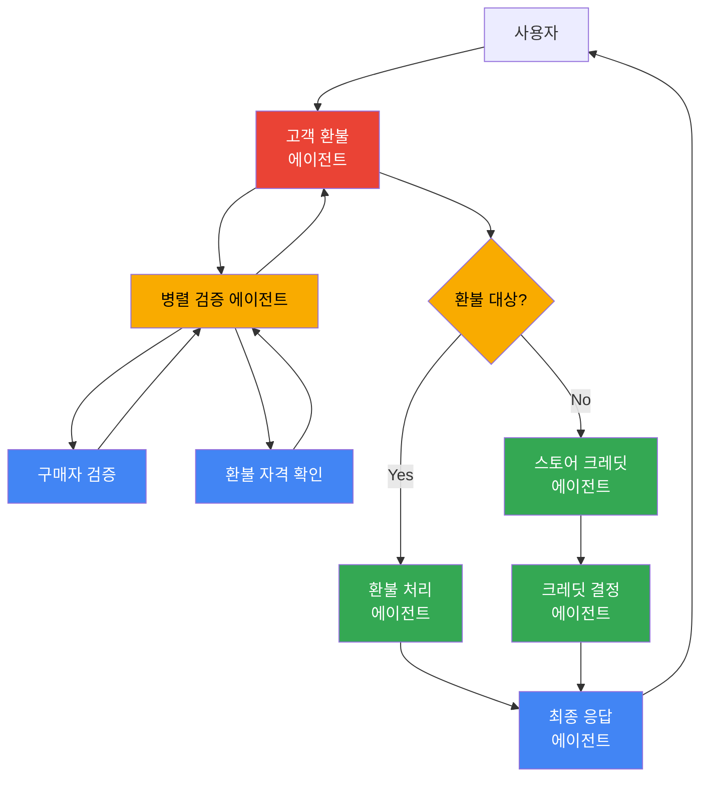

**적합:** 표준 패턴에 맞지 않는 고유 워크플로, 세밀한 실행 제어가 필요한 경우

| 장점 | 단점 |
|------|------|
| 최대 유연성 | 개발/유지보수 복잡성 증가 |
| 여러 패턴 혼합 가능 | 사전 정의 패턴 대비 오류 발생 쉬움 |
| 세밀한 프로세스 제어 | 직접 오케스트레이션 설계/구현/디버깅 필요 |

---

## 8. 설계 패턴 비교

### 워크플로 유형별 분류

#### 결정론적 워크플로 (Deterministic)

예측 가능하고, 시작~종료까지 명확한 경로가 정의된 작업.

| 워크로드 특성 | 패턴 |
|-------------|------|
| 고정 순서, 모델 오케스트레이션 불필요 | **순차 패턴** |
| 독립적 하위 작업 동시 실행, 모델 오케스트레이션 불필요 | **병렬 패턴** |
| 복잡한 생성 작업, 다중 사이클 점진 개선, 품질 우선 | **반복적 개선 패턴** |

#### 동적 오케스트레이션 워크플로 (Dynamic)

사전 정의 스크립트 없이 동적으로 계획/위임/조정해야 하는 작업.

| 워크로드 특성 | 패턴 |
|-------------|------|
| 외부 도구 필요, 프로토타이핑 | **단일 에이전트** |
| 다양한 입력 → 전문 에이전트로 동적 라우팅 | **코디네이터 패턴** |
| 다단계 분해, 모호하고 개방적인 문제 | **계층적 작업 분해 패턴** |
| 공동 토론, 반복 개선, 다양한 관점 종합 | **스웜 패턴** |

#### 반복 워크플로 (Iterative)

개선, 피드백, 개선 주기를 통해 최종 결과를 달성하는 작업.

| 워크로드 특성 | 패턴 |
|-------------|------|
| 반복적 추론 → 행동 → 관찰, 정확도 우선 | **ReAct 패턴** |
| 종료 조건까지 사전 정의 작업 반복 (모니터링/폴링) | **루프 패턴** |
| 완료 전 별도 유효성 검사 필요 | **리뷰 및 비판 패턴** |
| 다중 사이클 점진 개선, 품질 우선 | **반복적 개선 패턴** |

#### 특수 요구사항 워크플로 (Special)

일반 패턴에 맞지 않는 고유한 요구사항이 있는 작업.

| 워크로드 특성 | 패턴 |
|-------------|------|
| 인적 감독, 안전/규정 준수, 주관적 승인 필요 | **인간 참여형 패턴** |
| 복잡한 분기 로직, 규칙+추론 혼합, 세밀한 제어 | **맞춤 로직 패턴** |

---

### 패턴 종합 비교표

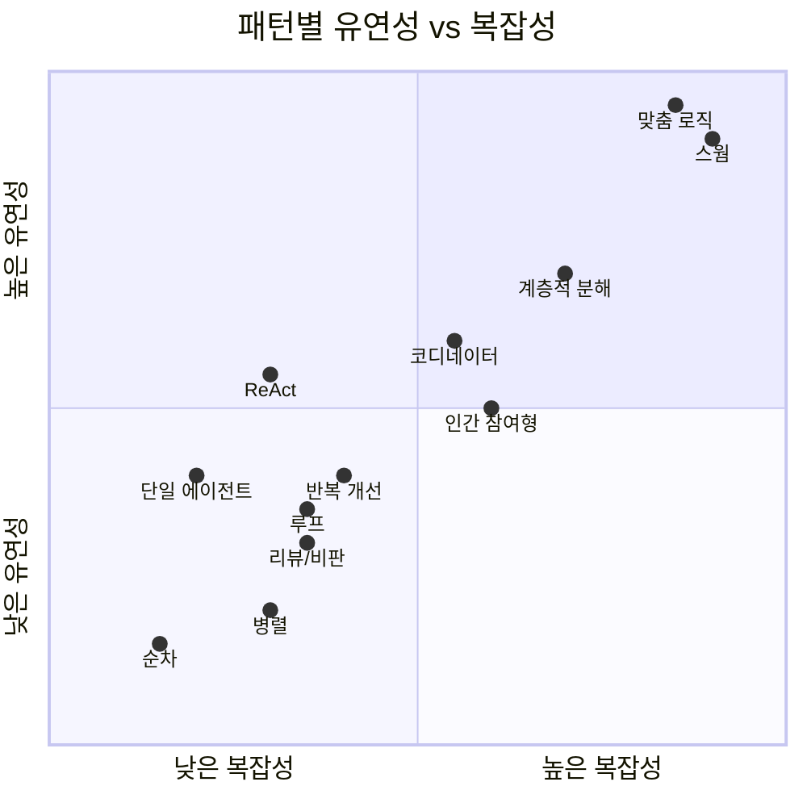

| 패턴 | 모델 오케스트레이션 | 지연 시간 | 비용 | 유연성 | 구현 복잡도 |
|------|:------------------:|:---------:|:----:|:------:|:-----------:|
| 단일 에이전트 | O | 낮음 | 낮음 | 중간 | 낮음 |
| 순차 | X | 낮음 | 낮음 | 낮음 | 낮음 |
| 병렬 | X | 낮음 | 중간 | 낮음 | 중간 |
| 루프 | X | 가변 | 가변 | 중간 | 중간 |
| 리뷰/비판 | X | 중간 | 중간 | 중간 | 중간 |
| 반복 개선 | X | 높음 | 높음 | 중간 | 중간 |
| ReAct | O | 중간 | 중간 | 높음 | 중간 |
| 코디네이터 | O | 높음 | 높음 | 높음 | 높음 |
| 계층적 분해 | O | 매우 높음 | 매우 높음 | 높음 | 매우 높음 |
| 스웜 | X (에이전트 간) | 매우 높음 | 매우 높음 | 매우 높음 | 매우 높음 |
| 인간 참여형 | - | 가변 | 중간 | 중간 | 높음 |
| 맞춤 로직 | 혼합 | 가변 | 가변 | 매우 높음 | 매우 높음 |

---

## 9. 패턴 선택 의사결정 플로우

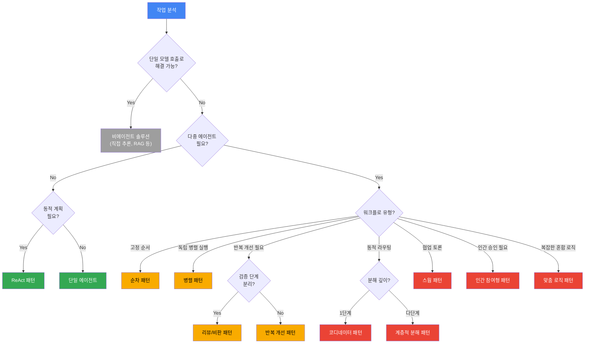

---

## References

- [Google Cloud: Selecting design patterns for agentic AI systems](https://cloud.google.com/discover/agentic-ai-design-patterns)
- [Google Cloud: Multi-agent AI systems](https://cloud.google.com/discover/what-are-multi-agent-ai-systems)
- [Google ADK: Agent Development Kit](https://google.github.io/adk-docs/)
