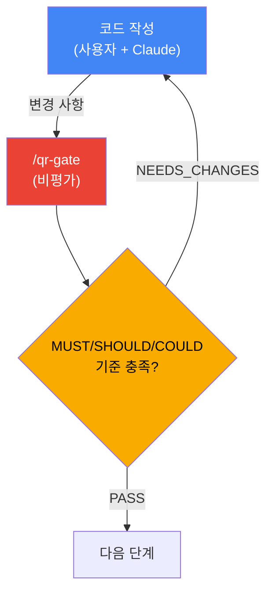
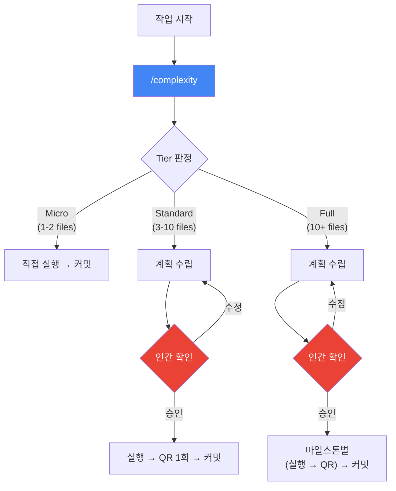
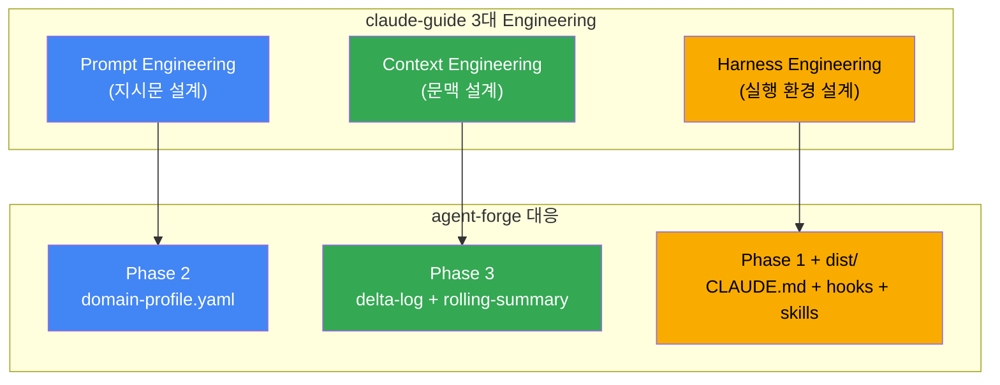
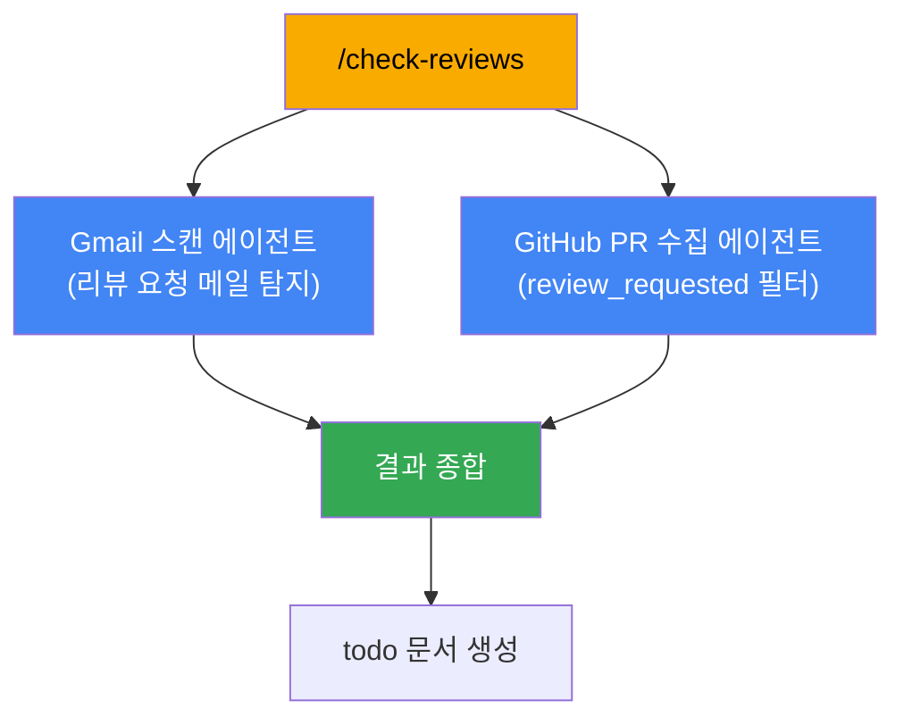
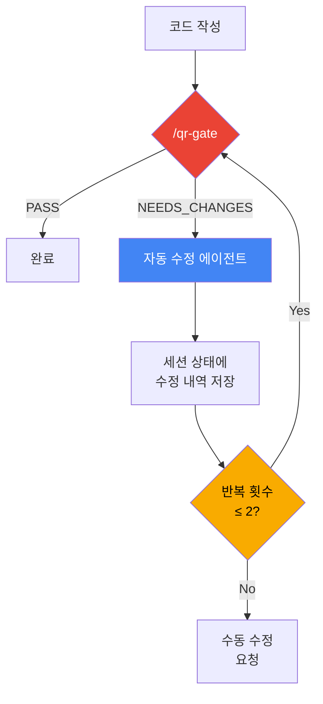
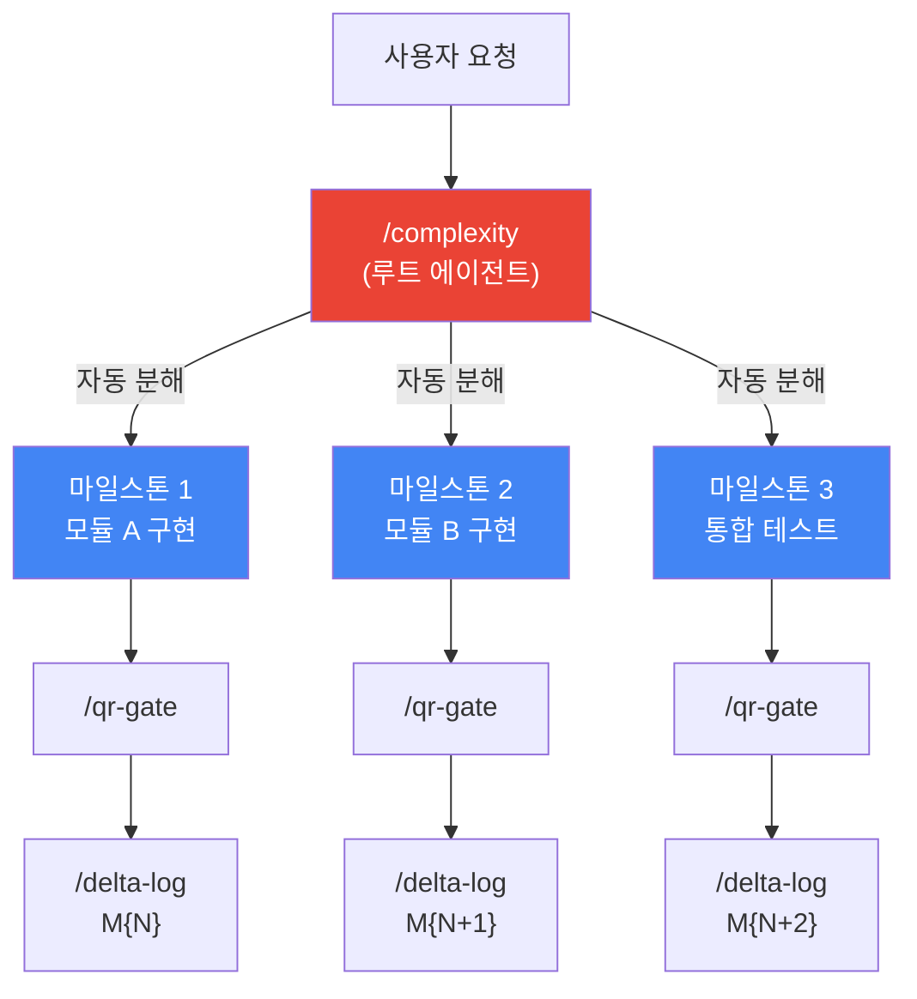
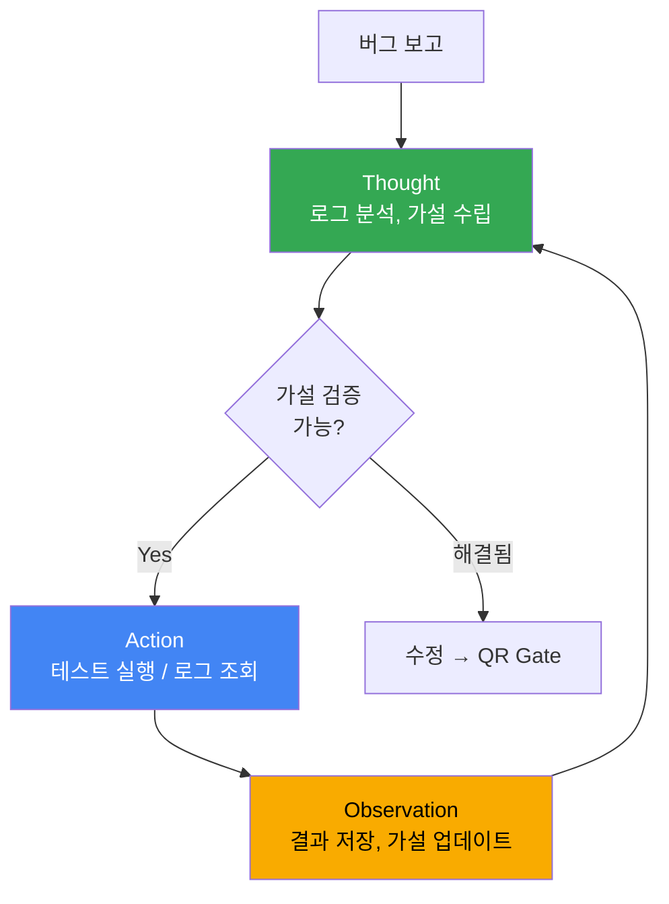
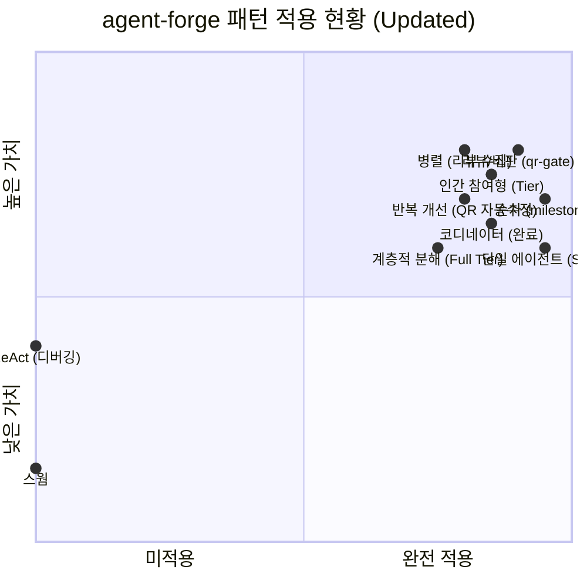

# Agent-Forge 패턴 적용 분석

> agent-pattern.md(Google Cloud 에이전트 패턴)와 claude-guide.md(Claude Code 마스터 가이드)를
> 종합하여 현재 프로젝트에 적용된/적용 가능한 패턴을 분석한다.

---

## 1. 분석 관점

두 문서는 에이전트 시스템을 서로 다른 관점에서 다룬다.

| 문서 | 관점 | 초점 |
|------|------|------|
| **agent-pattern.md** | 런타임 에이전트 아키텍처 | 에이전트 간 오케스트레이션, 작업 분해, 통신 패턴 |
| **claude-guide.md** | 개발자 작업 흐름 설계 | Context/Prompt/Harness Engineering, Skills, Hooks, 운영 구조 |

agent-forge는 **방법론 프레임워크 + MCP 도구 플랫폼**이므로, 양쪽 관점이 모두 적용된다.
런타임 수준에서는 MCP 서버와 스킬이 에이전트 패턴을 구현하고,
작업 흐름 수준에서는 Tier 분기, QR Gate, delta-log가 Harness Engineering을 구현한다.

---

## 2. 이미 적용된 패턴

### 2.1 순차 패턴 (Sequential) — `/milestone`

- 이전 단계의 출력이 다음 단계의 입력이 되는 선형 파이프라인
- AI 모델 오케스트레이션 없이 사전 정의된 순서로 실행
- **agent-pattern 매핑**: 멀티 에이전트 순차 패턴 (Section 4.1)

### 2.2 리뷰 & 비판 패턴 (Review & Critique) — `/qr-gate`

- 생성기(사용자+Claude)가 코드를 작성하고, `/qr-gate`가 검증
- MUST/SHOULD/COULD 3단계 심각도로 분류
- domain-profile.yaml의 priority_matrix(0.3~1.0)로 심각도 조정 가능
- `NEEDS_CHANGES` 시 수정 루프 발생 → 루프 패턴의 구현체
- **agent-pattern 매핑**: 리뷰 및 비판 패턴 (Section 4.4)

### 2.3 인간 참여형 패턴 (Human-in-the-Loop) — Tier 분기

- Standard/Full Tier에서 계획을 사용자에게 보여주고 확인 후에만 실행
- claude-guide의 **Plan Mode + Approval** 개념과 일치
- **agent-pattern 매핑**: 인간 참여형 패턴 (Section 6)

### 2.4 단일 에이전트 패턴 — 각 Skill

각 스킬(`/complexity`, `/qr-gate`, `/delta-log` 등)이 독립적인 단일 에이전트로 동작한다.

| Skill | 시스템 프롬프트 역할 | 도구 |
|-------|---------------------|------|
| `/complexity` | 복잡도 평가자 | 파일 탐색, 의존성 분석 |
| `/qr-gate` | 품질 검증자 | CLAUDE.md, domain-profile, diff 읽기 |
| `/delta-log` | 기록자 | delta-log JSON 생성, rolling-summary 갱신 |
| `/check-reviews` | 리뷰 탐지기 | Gmail 스캔, GitHub PR 수집 |
| `/do-review` | 코드 리뷰어 | 서브 에이전트 실행 |

- **agent-pattern 매핑**: 단일 에이전트 시스템 (Section 3)

### 2.5 코디네이터 패턴 (부분 적용) — `/milestone`

`/milestone`이 여러 스킬을 순서대로 호출하는 코디네이터 역할을 수행한다.
다만 현재는 **정적 라우팅**(고정 순서)이므로 완전한 코디네이터 패턴은 아니다.

- 동적 라우팅이 추가되면 (예: Micro Tier는 QR 건너뛰기) 완전한 코디네이터 패턴이 된다
- **agent-pattern 매핑**: 코디네이터 패턴 (Section 4.6, 부분 적용)

---

## 3. claude-guide 핵심 개념과의 대응 관계

### 3.1 3대 Engineering 매핑

claude-guide는 에이전트 활용의 핵심을 세 층으로 분리한다.

| claude-guide 개념 | agent-forge 대응 | 구현 수준 |
|-------------------|-----------------|-----------|
| **Context Engineering** | Phase 3: delta-log + rolling-summary + merge rules | 구현 완료 |
| **Harness Engineering** | CLAUDE.md + hooks + settings.json + Tier 분기 | 구현 완료 |
| **Prompt Engineering** | Phase 2: domain-profile.yaml (도메인별 지시문 커스터마이징) | 스키마만 완성 |

### 3.2 상세 개념 매핑

| claude-guide 개념 | 설명 | agent-forge 대응 | 현재 상태 |
|-------------------|------|-----------------|-----------|
| **Plan Mode** | 탐색과 실행 분리 | Standard/Full Tier 계획 단계 | 구현됨 |
| **Approval** | 위험 작업 전 인간 승인 | QR Gate 체크포인트 | 구현됨 |
| **AskUserQuestion** | 구조화된 질문으로 요구사항 수집 | (미적용) | 확장 가능 |
| **Skills** | 반복 작업 절차 패키지 | dist/skills/ (6개) | 구현됨 |
| **Hooks** | 자동 개입 규칙 | pre-commit QR, session-end checklist | 구현됨 |
| **Plugins** | 역할 패키지 (skills+hooks+MCP 묶음) | dist/ 전체가 plugin 역할 | 구조 존재 |
| **MCP** | 외부 도구 연결 규격 | workspace-mcp(24 tools), token-monitor-mcp(5 tools) | 구현됨 |
| **Handoff** | 세션 간 인수인계 | rolling-summary.md | 구현됨 |
| **Self-improvement Loop** | Skill 반복 개선 루프 | (미적용) | 적용 가능 |
| **Agent Teams** | 여러 에이전트 협업 | (미적용) | Full Tier에서 확장 가능 |
| **Scheduled Tasks** | 예약 실행 작업 | (미적용) | workspace-mcp batch scheduler로 확장 가능 |
| **Progressive Disclosure** | 단계적 정보 노출 | skill frontmatter로 부분 적용 | 최적화 가능 |

### 3.3 공통 원칙

두 문서가 공통으로 강조하는 핵심 원칙:

1. **구조 → 자동화 순서**: 규칙과 컨텍스트를 먼저 고정한 후에 자동화 확장
2. **상태 외부화**: 모델 머릿속이 아닌 파일(plan.md, handoff.md, delta-log)로 상태 관리
3. **검증 루프 필수**: 생성 후 반드시 검증 단계를 거침
4. **점진적 복잡도 증가**: 단일 에이전트 → 순차 → 병렬 → 코디네이터 순서로 확장

---

## 4. 적용 가능한 새로운 패턴

### 4.1 병렬 패턴 — 리뷰 수집 개선

**우선순위: 높음** | **구현 난이도: 낮음** | **효과: 지연 시간 50% 감소**

현재 `/check-reviews`는 Gmail 스캔과 GitHub PR 수집을 순차적으로 처리한다.
두 작업은 독립적이므로 병렬 실행이 가능하다.

workspace-mcp의 `gmail_search`와 `github_list_prs`가 이미 독립 MCP 도구로 존재하므로,
병렬 호출만으로 구현 가능하다.

### 4.2 반복적 개선 패턴 — QR 자동 수정 루프

**우선순위: 중간** | **구현 난이도: 중간** | **효과: 수동 수정 횟수 감소**

현재 QR Gate에서 `NEEDS_CHANGES`가 나오면 사용자가 수동으로 수정한다.
자동 수정 에이전트를 추가하면 반복적 개선 패턴이 된다.

claude-guide 9.8절의 self-improvement loop 원리 적용:
- QR 실패 항목을 구조화된 피드백으로 변환
- 자동 수정 에이전트가 피드백 기반으로 수정
- 최대 2회 반복 후 사람에게 넘김 (무한 루프 방지)

### 4.3 계층적 작업 분해 — Full Tier 강화

**우선순위: 중간** | **구현 난이도: 높음** | **효과: 대규모 작업의 체계적 관리**

현재 Full Tier는 마일스톤을 사용자가 직접 정의한다.
`/complexity`가 작업을 자동 분해하면 계층적 작업 분해 패턴이 된다.

claude-guide의 **Agent Teams + worktree** 조합과 일치:
- 독립적인 마일스톤은 별도 Git worktree에서 병렬 작업 가능
- 각 마일스톤 완료 시 자동으로 delta-log 엔트리 생성
- rolling-summary가 전체 진행 상태를 누적 관리

### 4.4 ReAct 패턴 — 디버깅 워크플로

**우선순위: 낮음** | **구현 난이도: 중간** | **효과: 복잡한 버그 해결 체계화**

현재 agent-forge에 디버깅 전용 워크플로가 없다.
ReAct 패턴으로 구조화된 디버깅 스킬을 추가할 수 있다.

---

## 5. 즉시 적용 가능한 프로세스 개선

구현이 필요 없이 프로세스 수준에서 바로 적용할 수 있는 항목:

| claude-guide 패턴 | 적용 방법 | 기대 효과 |
|-------------------|-----------|-----------|
| **handoff.md** | `/milestone`에 handoff 파일 생성 단계 추가 | 세션 간 컨텍스트 손실 방지 |
| **AskUserQuestion** | `/complexity` 실행 시 모호한 작업에 구조화된 질문 | 초기 요구사항 품질 향상 |
| **Progressive Disclosure** | skill frontmatter `description` 최적화 | 불필요한 skill 로딩 감소, 토큰 절약 |
| **30/60/90 도입 로드맵** | install.sh 실행 후 단계별 가이드 제공 | 사용자 온보딩 성공률 향상 |
| **도입 우선순위** | 설치 가이드에 "CLAUDE.md → rules → hooks → skills → MCP" 순서 명시 | 구조 먼저, 자동화 나중 원칙 적용 |

---

## 6. 패턴별 적용 현황 종합

| 패턴 | 적용 상태 | 구현체 | 비고 |
|------|:---------:|--------|------|
| 순차 | **완료** | `/milestone` | 동적 라우팅 파이프라인 (handoff 포함) |
| 리뷰/비판 | **완료** | `/qr-gate` | MUST/SHOULD/COULD + 자동 수정 루프 (최대 2회) |
| 인간 참여형 | **완료** | Tier 분기 (Standard/Full) | Plan Mode + Approval + Full Tier 마일스톤 확인 |
| 단일 에이전트 | **완료** | 7개 Skills 각각 | +/handoff 추가 |
| 코디네이터 | **완료** | `/milestone` | Tier별 동적 라우팅 (Micro fast-path, Full full-path) |
| 병렬 | **완료** | `/check-reviews` | pending + todo + done 병렬 MCP 호출 |
| 반복적 개선 | **완료** | `/qr-gate` | 자동 수정 루프 (2회) + 반복별 디에스컬레이션 |
| 계층적 분해 | **완료** | `/complexity` (Full Tier) | 자동 마일스톤 분해 + Wave 기반 병렬 실행 계획 |
| ReAct | **미적용** | — | 디버깅 워크플로 스킬로 추가 가능 |
| 루프 | **명시적** | QR 자동 수정 루프 | 최대 2회 + 반복별 디에스컬레이션 + 수동 전환 |
| 스웜 | **불필요** | — | 현재 프로젝트 규모에 과도함 |
| 맞춤 로직 | **완료** | 전체 Tier 시스템 | 여러 패턴 통합 완성 |

---

## 7. 권장 개선 로드맵

agent-forge의 Phase 구조와 claude-guide의 30/60/90 로드맵을 결합한 단계별 개선 계획:

### Phase A: 프로세스 최적화 (즉시 적용) — DONE

- [x] `/milestone`에 handoff.md 생성 단계 추가
- [x] skill frontmatter `description` 최적화 (Progressive Disclosure)
- [x] install.sh에 단계별 도입 가이드 추가 (30/60/90 로드맵 포함)

### Phase B: 병렬 패턴 도입 — DONE

- [x] `/check-reviews`에 Gmail + GitHub 병렬 수집 적용
- [ ] workspace-mcp batch scheduler에 병렬 처리 옵션 추가

### Phase C: 반복적 개선 패턴 도입 — DONE

- [x] QR Gate 자동 수정 루프 구현 (최대 2회 반복 + 반복별 디에스컬레이션)
- [ ] Self-improvement loop 기반 skill 품질 측정 체계 도입
- [ ] Phase 2 domain-profile 통합 (Prompt Engineering 층 완성)

### Phase D: 계층적 분해 패턴 도입 — DONE

- [x] Full Tier에 자동 마일스톤 분해 기능 추가 (Wave 기반 실행 계획)
- [ ] Agent Teams + worktree 조합으로 병렬 마일스톤 실행
- [ ] Phase 4 측정 체계와 연동하여 패턴별 효과 정량화

### Phase E: 세션 관리 강화 — DONE (신규)

- [x] `/handoff` 세션 인수인계 전용 스킬 생성
- [x] `/milestone` 동적 라우팅으로 코디네이터 패턴 완성
- [x] CLAUDE.md 템플릿 업데이트 (7개 스킬, handoff 포함 워크플로우)

---

## References

- [agent-pattern.md](./agent-pattern.md) — Google Cloud 에이전트 설계 패턴 정리
- [claude-guide.md](./claude-guide.md) — Claude Code 및 Cowork 마스터 가이드
- [ARCHITECTURE.md](./ARCHITECTURE.md) — agent-forge 시스템 아키텍처
- [ROADMAP.md](./ROADMAP.md) — 4 Phase 실행 로드맵
